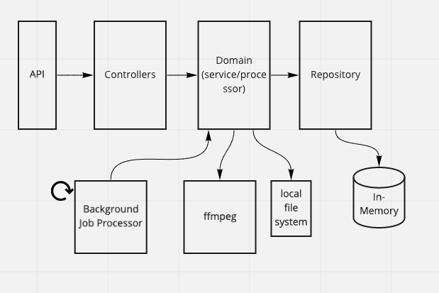

# Concatenate Videos


## Development

This application is designed to be developed locally using docker compose.

### Prerequisites

- Docker (e.g. [Docker Desktop][])
- Docker Compose (included with Docker Desktop)

### Running the application

```sh
# Starts both the api and the background job processor in the background
npm run dev:start
```

### Accessing the application

The API runs on port 8000, and can be accessed locally at `http://localhost:8000`

### Viewing logs

```sh
# Tails the logs in real time
npm run dev:logs
```

### Stopping the application

```sh
# Stops the api and the background job processor, and removes the containers
npm run dev:stop
```

## Architecture



### API Call Flow

```
POST /jobs
{
    "sourceVideoUrls": ["<url to mp4>", "<url to another mp4>"]
    "destination": {
        "directory": "<local path of directory that'll store merged file>"
    }
}
```

returns

```
{
    "id": "<job id>"
    "status": "<url to status of job>"
}
```

```
GET /job/{jobId}/status
```

returns

```
{
    "status": "pending"
}
```


<!-- Links -->

[Docker Desktop]: https://www.docker.com/products/docker-desktop/
